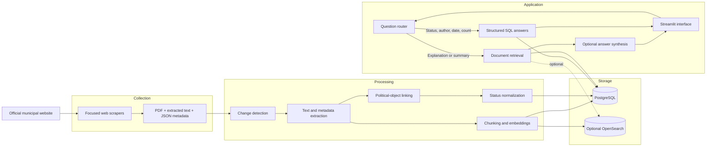
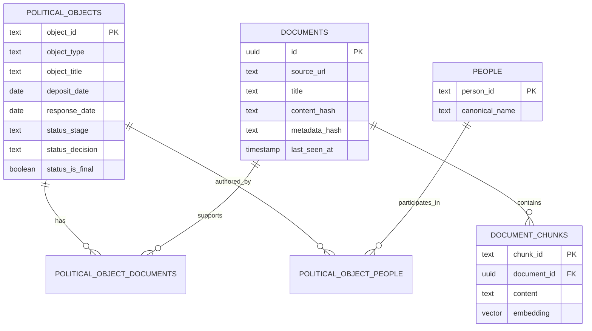
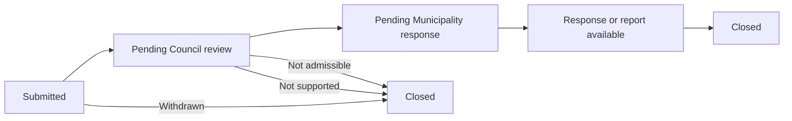
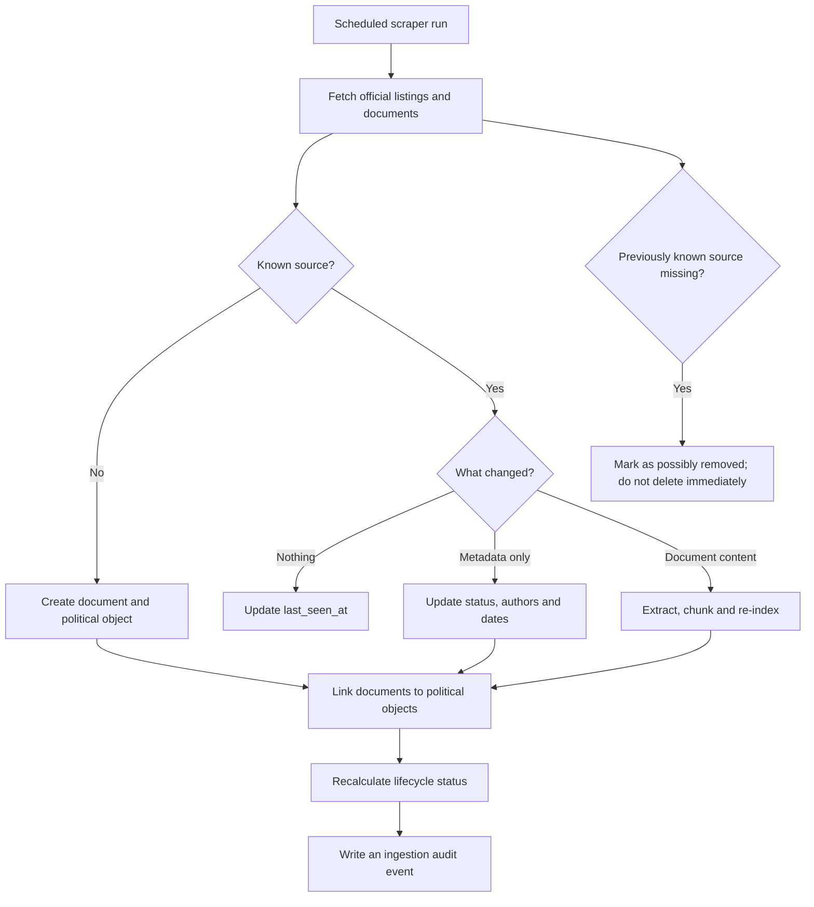
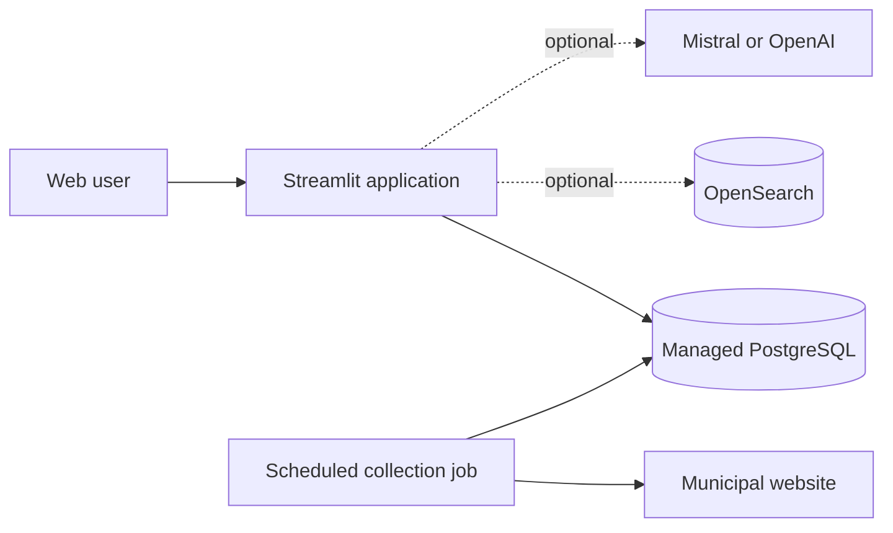

# AI Riviera — System Design

## 1. Project in one sentence

AI Riviera helps citizens and elected representatives find, understand and follow municipal political objects while keeping every answer verifiable through official sources.

### Initial product scope

- Motions
- Postulates
- Interpellations
- Municipal responses, reports and decisions linked to those objects
- Council regulations used to explain procedures
- Minutes and agendas used as supporting evidence

Budgets, accounts and unrelated municipal documents can remain stored, but are excluded from the default search experience.

## 2. Main user questions

- Who submitted this political object?
- What subject does it concern?
- When was it submitted?
- Is it waiting for the Council or the Municipality?
- Is a response, report or decision available?
- Which objects are still pending?
- What is the official source?

## 3. High-level architecture



## 4. Why two answer paths?

### Structured SQL path

Used for facts that must be exact:

- authors and parties;
- submission and response dates;
- current status;
- counts by year or type;
- pending or completed objects.

### Document retrieval path

Used when the answer requires reading source text:

- explaining what an interpellation asks;
- summarizing a municipal response;
- comparing several political objects;
- identifying recurring themes.

The language model never acts as the database. It summarizes retrieved evidence and displays the official sources.

## 5. Core data model



`metadata_hash` and `last_seen_at` are target improvements. The current implementation already stores document and content hashes.

## 6. Shared status model



Common internal stages:

```text
submitted
pending_council_review
pending_municipality_response
response_available
closed
```

Separate outcomes preserve procedural detail:

```text
completed
withdrawn
inadmissible
not_supported
accepted
refused
unknown
```

## 7. Incremental update design



Recommended schedule: weekly and after every Council meeting.

## 8. Reliability and trust

- Every answer links to an official document.
- Structured facts come from PostgreSQL rather than model memory.
- Changed documents are reprocessed using hashes.
- Missing sources are flagged instead of silently deleted.
- Ingestion runs and failures are logged.
- The application says when the available sources are insufficient.
- Public documents remain separated from any future private workspace.

## 9. Current implementation versus target

| Area | Current | Target improvement |
|---|---|---|
| Sources | Broad municipal corpus | Political-object-first default scope |
| Storage | PostgreSQL, optional OpenSearch | Keep PostgreSQL as source of truth |
| Change detection | Content/document hashes | Separate content and metadata hashes |
| Scraping | Scripts run separately | One scheduled update workflow |
| Statuses | Raw and normalized fields | Five shared lifecycle stages |
| Removed pages | Not explicitly tracked | `last_seen_at` and missing-source flag |
| Evaluation | Small mixed question set | Focused benchmark across political objects |

## 10. Deployment view



The application can still return retrieved passages without an LLM key. The LLM improves synthesis but is not required to access sources.

## 11. Suggested presentation narrative

> Municipal information exists, but it is fragmented across PDFs, meeting pages and document categories. AI Riviera collects official sources, connects each motion, postulate or interpellation to its authors, dates, responses and decisions, and stores those facts in PostgreSQL. Exact questions are answered through structured SQL; explanatory questions use document retrieval. Every result links back to the official source. The next architectural step is incremental monitoring, so a new response or status change updates the object without rebuilding the complete corpus.

## 12. Success criteria

- Correct source appears in the top five retrieved results.
- Author, date and status answers match manually verified records.
- Pending objects are not confused with answered or withdrawn objects.
- Metadata-only changes update without unnecessary re-embedding.
- The system clearly abstains when no official evidence is available.
