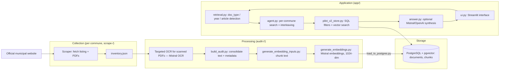
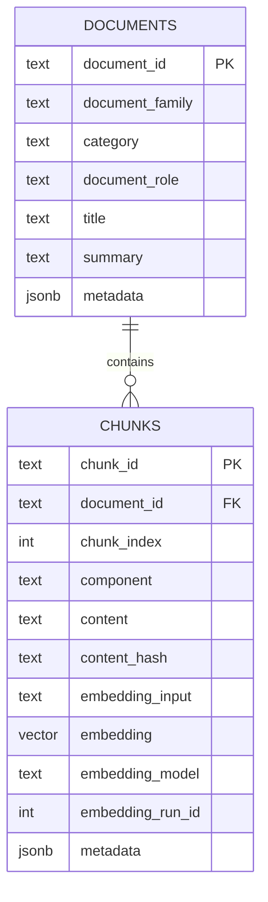
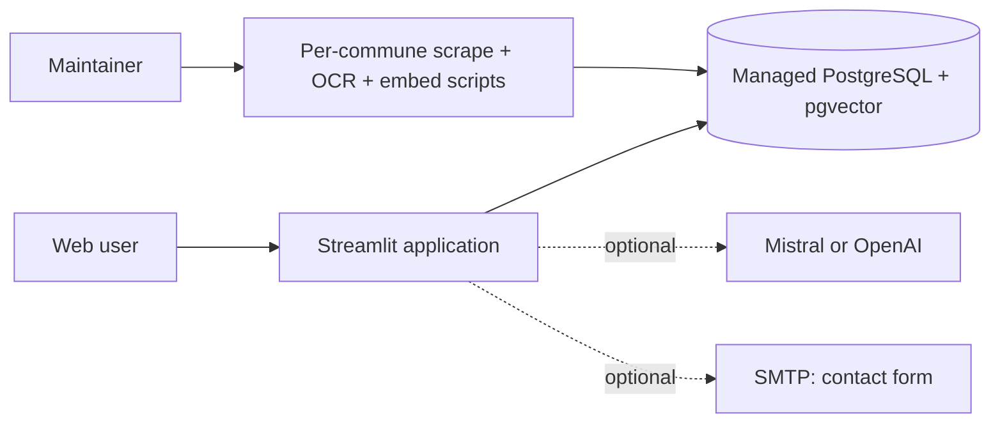

# AI Riviera — System Design

## 1. Project in one sentence

AI Riviera helps citizens and elected representatives find political objects (motions, postulates, interpellations) and their municipal responses across several Riviera communes, while keeping every answer verifiable through an official source link.

### Current scope

Per commune (see `municipal_pipeline/municipalities.py` for the live list):

- Motions, postulates, interpellations, and the municipal responses/reports linked to them.
- La Tour-de-Peilz additionally has préavis municipaux, procès-verbaux, budgets, rapports de gestion/comptes and the Conseil communal regulation.

Everything is scoped per document category (`interpellations`, `postulats`, `motions`, ...); there is no cross-commune "political object" identity beyond the document metadata itself.

## 2. Main user questions

- Who submitted this political object?
- What subject does it concern?
- When was it submitted?
- Is a response, report or decision available?
- Which interpellations/postulates received a response (optionally in a given year)?
- What is the official source?

## 3. High-level architecture

```mermaid
flowchart LR
    SITE[Official municipal website]

    subgraph COLLECTION["Collection (per commune, scrape-<commune>/)"]
        SCRAPERS[Scraper: fetch listing + PDFs]
        INVENTORY[inventory.json]
    end

    subgraph PROCESSING["Processing (audit-<commune>/<category>/)"]
        OCR[Targeted OCR for scanned PDFs — Mistral OCR]
        AUDIT[build_audit.py: consolidate text + metadata]
        CHUNK[generate_embedding_inputs.py: chunk text]
        EMBED[generate_embeddings.py: Mistral embeddings, 1024-dim]
    end

    subgraph STORAGE["Storage"]
        PG[(PostgreSQL + pgvector: documents, chunks)]
    end

    subgraph APPLICATION["Application (app/)"]
        RETRIEVAL[retrieval.py: doc_type / year / article detection]
        AGENT[agent.py: per-commune search + interleaving]
        STORE[pilot_v2_store.py: SQL filters + vector search]
        ANSWER[answer.py: optional Mistral/OpenAI synthesis]
        UI[ui.py: Streamlit interface]
    end

    SITE --> SCRAPERS --> INVENTORY --> OCR --> AUDIT --> CHUNK --> EMBED
    EMBED -->|load_to_postgres.py| PG

    UI --> RETRIEVAL --> AGENT --> STORE --> PG
    STORE --> ANSWER --> UI
```

Collection and processing run as one-off or periodically re-run scripts per commune and per document category — there is no scheduler yet (see §7). The application only reads from Postgres; it never scrapes or re-embeds at request time.

## 4. Why keyword detection instead of a full router?

`app/retrieval.py` does lightweight, French-keyword detection directly on the question text before hitting Postgres:

- a document type (`interpellation`, `postulat`, `motion`, `budget`, règlement du Conseil communal) from words in the query;
- a year, if a 4-digit `20xx` appears;
- an article number, for règlement questions.

Two extra detectors (`detect_answered_interpellations_query`, `detect_answered_postulates_query`) recognize "quelles interpellations ont reçu une réponse [en <year>]" style questions and turn them into a structured filter (`response_available=True`) instead of semantic search — a top-K vector sample can't reliably answer an enumeration question, and could mix an object's response with another commune's citation.

Everything else goes through `pilot_v2_store.search()`: a `pgvector` cosine-similarity search over `chunks.embedding`, narrowed by whichever filters were detected (`doc_type`, `year`, `city`, `article_number`). There is no separate SQL/RAG "router" module — `retrieval.py` and `pilot_v2_store.py` together are that logic.

`app/agent.py` adds one more layer for the "Tous" (all communes) case: it runs the same search per commune (`SEARCH_ENABLED_CITY_LABELS`, derived from `municipalities.py`) and interleaves the per-commune result lists round-robin, so one large commune's corpus doesn't drown out a smaller one.

`app/answer.py` turns the retrieved chunks into a French summary via Mistral or OpenAI (`LLM_PROVIDER=auto|mistral|openai`) if a key is configured. Without a key, the UI shows the retrieved passages and their sources directly — the LLM is not required to access sources, only to synthesize them.

## 5. Data model (actual)

```mermaid
erDiagram
    DOCUMENTS ||--o{ CHUNKS : contains

    DOCUMENTS {
        text document_id PK
        text document_family
        text category
        text document_role
        text title
        text summary
        jsonb metadata
    }

    CHUNKS {
        text chunk_id PK
        text document_id FK
        int chunk_index
        text component
        text content
        text content_hash
        text embedding_input
        vector embedding
        text embedding_model
        int embedding_run_id
        jsonb metadata
    }
```

There is one `documents` + `chunks` pair, shared by every commune and category — the commune (`city`), document type (`doc_type`), year, author, status and response-linking fields all live inside `metadata` (JSONB) rather than as normalized columns or separate tables. `pilot_v2_store._filter_clauses()` builds parameterized `metadata @> ...` / `metadata->>'...'` predicates for each supported filter. There is no `POLITICAL_OBJECTS`, `PEOPLE` or `POLITICAL_OBJECT_DOCUMENTS` table — object identity (which response belongs to which motion) is expressed through `document_role` and metadata cross-references set by each commune's scraper, not by a relational schema.

`embedding_runs` records one row per embedding batch (model name, recipe version, run timestamp, token count) for traceability of which run produced which vectors.

## 6. Reliability and trust

- Every answer links back to an official source URL, either directly (retrieved passage) or via the synthesized answer's citations (`app/ui.py::source_link`, `link_source_mentions`).
- Enumeration questions ("which interpellations got a response") use a structured metadata filter rather than trusting an LLM to count a sample correctly.
- The LLM only summarizes retrieved evidence; it is never asked to answer from memory.
- The app works with retrieval only (no LLM key needed) as a fallback.
- Source links are HTML-escaped and scheme-validated (`^https?://`) before being rendered with `unsafe_allow_html=True`, to avoid injecting arbitrary HTML/JS from document metadata.

## 7. Known gaps / target improvements

| Area | Current | Target improvement |
|---|---|---|
| Refresh | Scripts run manually per commune/category | Scheduled re-run with change detection (new documents only) |
| Change detection | `content_hash` per chunk, re-embed on change | Separate metadata-only vs. content changes to skip re-embedding when only status/author changes |
| Object linking | `document_role` + hand-checked metadata per commune | Explicit object-to-response linking table if a commune's corpus grows large enough to need it |
| Coverage | 5 communes search-enabled | Remaining Riviera communes shown greyed out in the UI (`— prochainement`) until their pipeline exists |
| Testing | `app/ui.py` mixes pure helpers with page-rendering side effects, causing an `AppTest` ordering artifact (see `tests/test_ui_document_tabs.py`) | Extract pure helpers into a module with no import-time Streamlit calls |

## 8. Deployment view

```mermaid
flowchart LR
    USER[Web user] --> APP[Streamlit application]
    APP --> DB[(Managed PostgreSQL + pgvector)]
    APP -. optional .-> MODEL[Mistral or OpenAI]
    APP -. optional .-> SMTP[SMTP: contact form]
    OPERATOR[Maintainer] --> SCRAPE[Per-commune scrape + OCR + embed scripts] --> DB
```

## 9. Success criteria

- Correct source appears in the top results for a representative question per commune.
- Author, date and "has a response" answers match manually verified records.
- "Which X received a response" enumerations never include an unanswered object.
- The app clearly states when no source supports an answer, instead of guessing.
